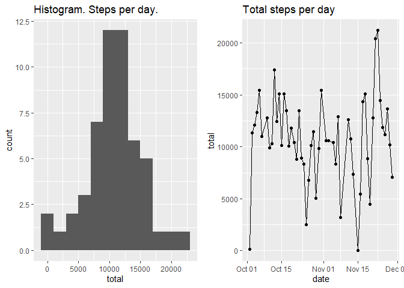
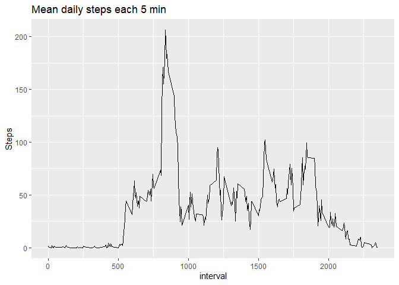
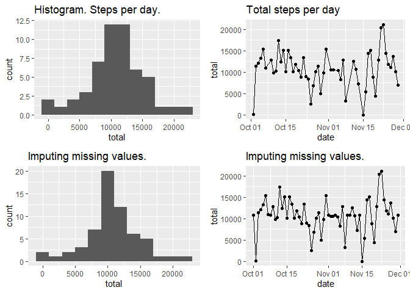
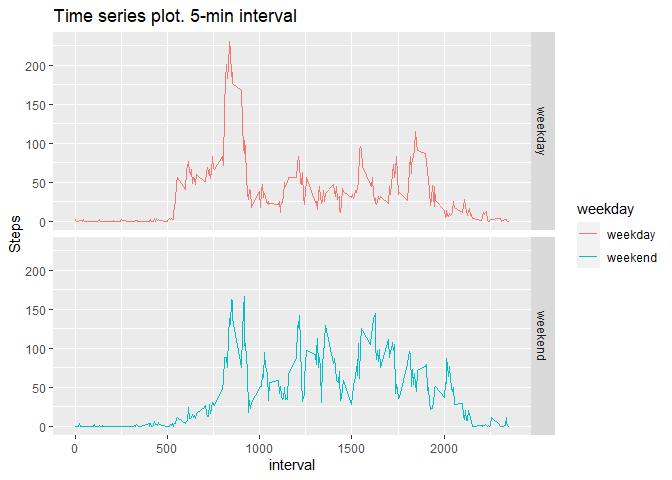

## Loading and preprocessing the data


```r
data <- read_csv("activity.csv", col_types = cols(steps = col_integer(), 
                                                date = col_date(), 
                                                interval = col_integer() ))
data_noNA <- filter(data,  !is.na(data$steps)) ## remove NA values
str(data_noNA)
```

```
## tibble [15,264 x 3] (S3: spec_tbl_df/tbl_df/tbl/data.frame)
##  $ steps   : int [1:15264] 0 0 0 0 0 0 0 0 0 0 ...
##  $ date    : Date[1:15264], format: "2012-10-02" "2012-10-02" ...
##  $ interval: int [1:15264] 0 5 10 15 20 25 30 35 40 45 ...
##  - attr(*, "spec")=
##   .. cols(
##   ..   steps = col_integer(),
##   ..   date = col_date(format = ""),
##   ..   interval = col_integer()
##   .. )
```

## What is mean total number of steps taken per day?


```r
steps_day <- data_noNA %>% group_by(date) %>% summarize(total = sum(steps))
head(steps_day,3)
```

```
## # A tibble: 3 x 2
##   date       total
##   <date>     <int>
## 1 2012-10-02   126
## 2 2012-10-03 11352
## 3 2012-10-04 12116
```

```r
g_his <- ggplot(steps_day, aes(total))+geom_histogram(binwidth = 2000)+
                labs(title = "Histogram. Steps per day.")
g_day <-  ggplot(steps_day, aes(x = date, y = total))+geom_point()+geom_path()+
                labs(title = "Total steps per day")
grid.arrange(g_his, g_day, ncol=2)
```

<!-- -->

```r
summ1 <- summary(steps_day$total)
```
Mean of total number of steps:

10766.2

## What is the average daily activity pattern?


```r
## Make a time series plot of the 5-minute interval (x-axis) and the average number of steps taken, 
## averaged across all days (y-axis)
steps_interval <- data_noNA %>% group_by(interval) %>% summarize(Steps = round(mean(steps),2))
## round(aggregate(steps~interval,data_noNA,mean),2)  ##Other way to do the same
g_day_pattern <- ggplot(steps_interval, aes(x=interval,y=Steps)) + geom_path() + 
        labs(title = "Mean daily steps each 5 min")
g_day_pattern
```

<!-- -->

```r
## Which 5-minute interval, on average across all the days in the dataset, contains the maximum number of steps?
steps_interval[which.max(steps_interval$Steps),]
```

```
## # A tibble: 1 x 2
##   interval Steps
##      <int> <dbl>
## 1      835  206.
```


## Imputing missing values


```r
## Calculate and report the total number of missing values in the dataset
sum(is.na(data$steps))
```

```
## [1] 2304
```

```r
## I wil use mean to fill missing values. col steps2 contains the mean values
newData <- data %>% group_by(date) %>% mutate(steps2 = steps_interval$Steps)
for(i in 1:length(newData$steps)){
        if(is.na(newData$steps[i])){
                newData$steps[i] <- newData$steps2[i]
        }
}
newData <- select(newData, c(1,2,3))
## New data set
head(newData,2)
```

```
## # A tibble: 2 x 3
## # Groups:   date [1]
##   steps date       interval
##   <dbl> <date>        <int>
## 1  1.72 2012-10-01        0
## 2  0.34 2012-10-01        5
```

```r
## new plots
steps_interval_2 <- newData %>% group_by(interval) %>% summarize(Steps = round(mean(steps),2))
steps_day_2 <- newData %>% group_by(date) %>% summarize(total = sum(steps))
g_his_2 <- ggplot(steps_day_2, aes(total))+geom_histogram(binwidth = 2000)+
                labs(title = "Imputing missing values.")
g_day_2 <-  ggplot(steps_day_2, aes(x = date, y = total))+geom_point()+geom_path()+
                labs(title = "Imputing missing values.")
grid.arrange(g_his,g_day,g_his_2, g_day_2, ncol=2)
```

<!-- -->

```r
summ2 <- summary(steps_day_2$total)
```

Doing a quick summary on the data with (summ2) and without Na values (summ2), we see no changes on 
mean value as spected because of the strategy for imputing Na values.


```r
tb <- xtable(data.frame(rbind(summ1,summ2)))
print(tb, type ="html")
```

<!-- html table generated in R 4.0.0 by xtable 1.8-4 package -->
<!-- Mon Jun 08 15:40:32 2020 -->
<table border=1>
<tr> <th>  </th> <th> Min. </th> <th> X1st.Qu. </th> <th> Median </th> <th> Mean </th> <th> X3rd.Qu. </th> <th> Max. </th>  </tr>
  <tr> <td align="right"> summ1 </td> <td align="right"> 41.00 </td> <td align="right"> 8841.00 </td> <td align="right"> 10765.00 </td> <td align="right"> 10766.19 </td> <td align="right"> 13294.00 </td> <td align="right"> 21194.00 </td> </tr>
  <tr> <td align="right"> summ2 </td> <td align="right"> 41.00 </td> <td align="right"> 9819.00 </td> <td align="right"> 10766.13 </td> <td align="right"> 10766.18 </td> <td align="right"> 12811.00 </td> <td align="right"> 21194.00 </td> </tr>
   </table>

## Are there differences in activity patterns between weekdays and weekends?

For this part the weekdays() function may be of some help here. Use the dataset with the filled-in missing 
values for this part.

Create a new factor variable in the dataset with two levels – “weekday” and “weekend” indicating whether a given 
date is a weekday or weekend day.


```r
newData <- newData %>% mutate(weekday = weekdays(date))
for(i in 1:nrow(newData)){
         newData$weekday[i] <- if(weekdays(newData$date[i]) == "Saturday" | weekdays(newData$date[i]) == "Sunday"){
               "weekend"
        }else{ "weekday" }
}
weeklist <- split(newData, newData$weekday)
```

Make a panel plot containing a time series plot of the 5-minute interval (x-axis) and the average number of steps
taken, averaged across all weekday days or weekend days (y-axis). I think the easiest way to look for any pattern 
change is to superimpose both data patterns:


```r
day_interval <- newData %>% group_by(interval,weekday) %>% summarize(Steps = round(mean(steps),2))
g_week <- ggplot(day_interval, aes(x=interval,y=Steps)) 
g_week + facet_grid(weekday~.)+ geom_path(aes(color=weekday))+ labs(title = "Time series plot. 5-min interval")
```

<!-- -->
